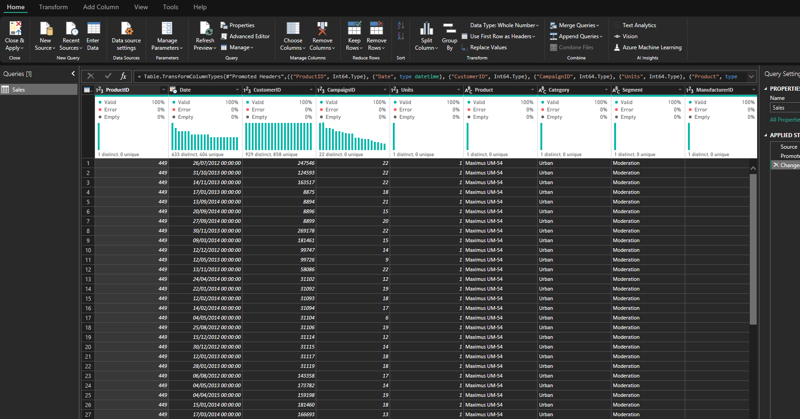
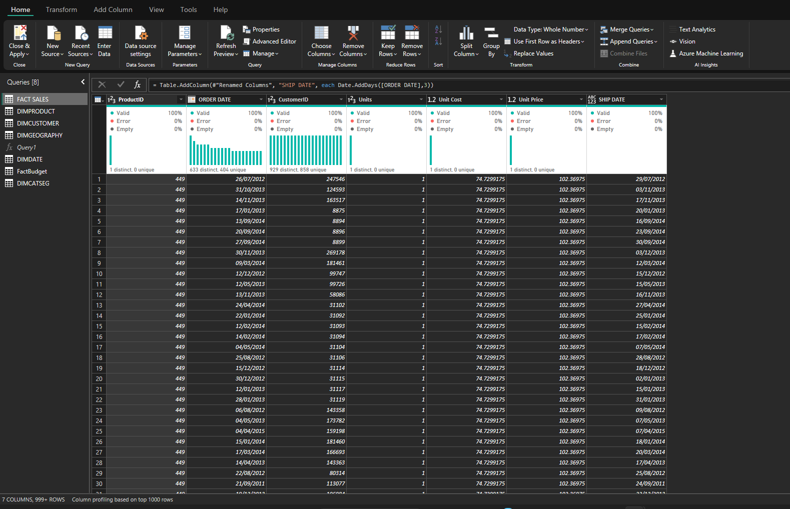
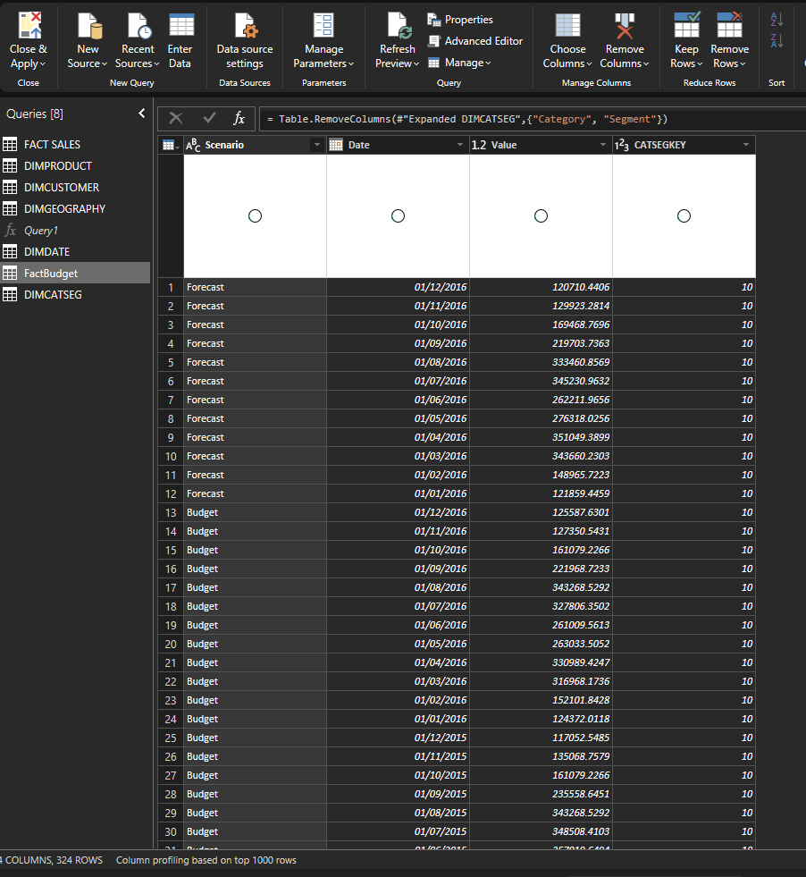
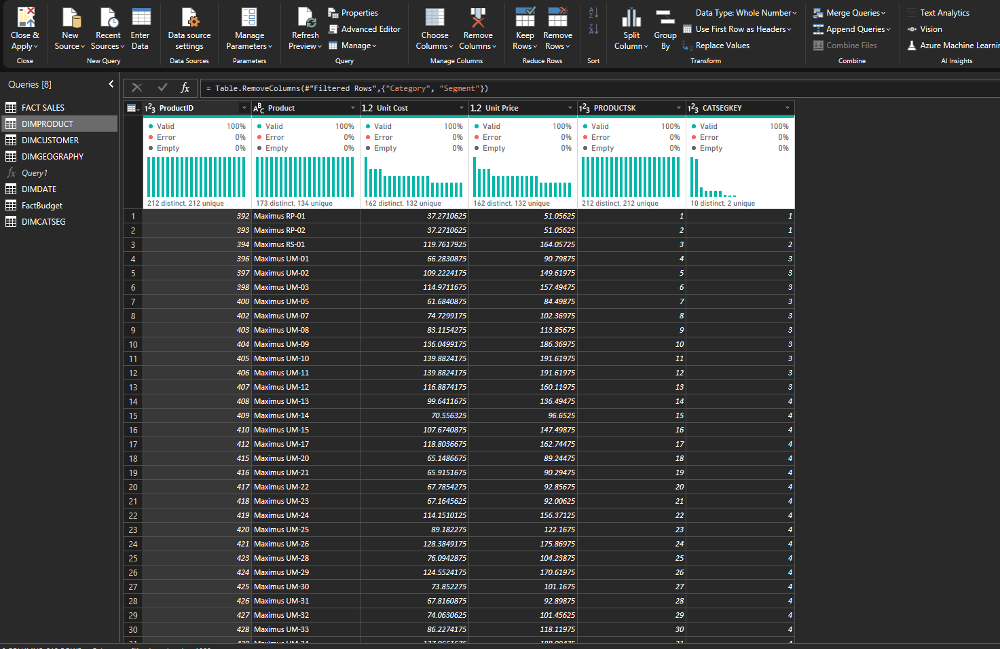
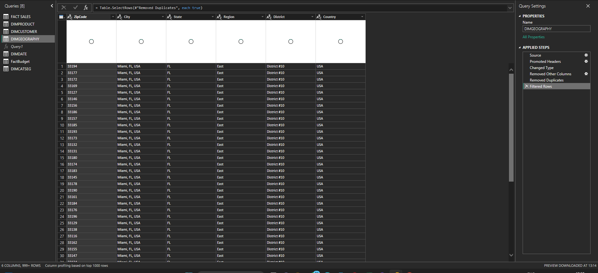
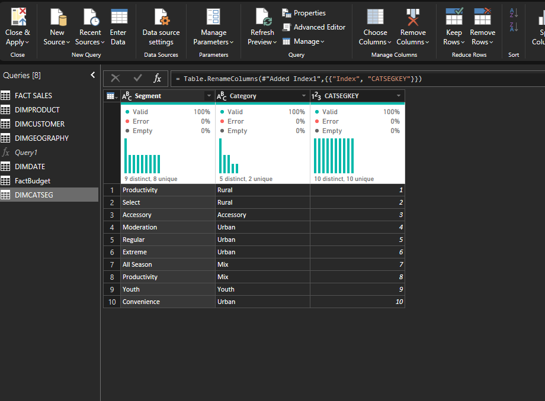
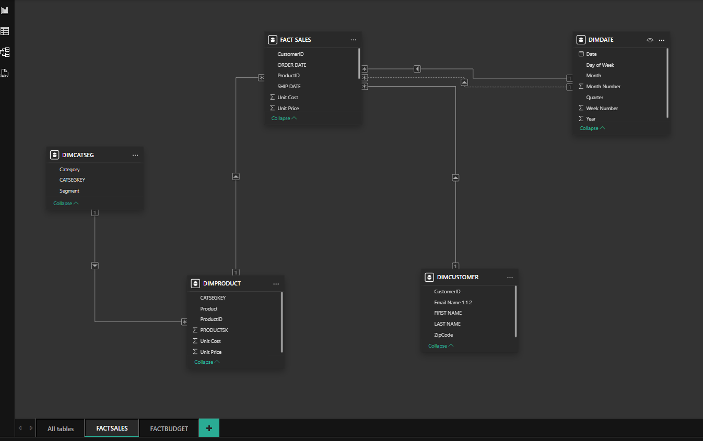
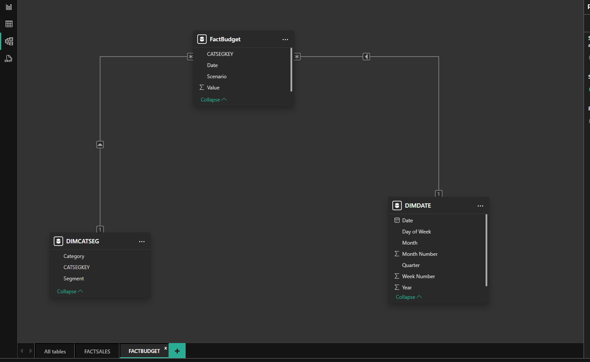
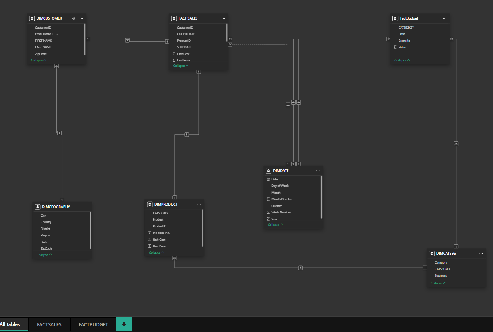

# Data-Modelling

## overview
This Power BI project focused on developing a clean, scalable data model using **star schema design principles**. The core of the project involved transforming raw sales and budget data into a structured format optimized for business analysis. Key efforts were dedicated to building a reliable data model, establishing appropriate relationships between tables, and designing effective DAX measures to facilitate insightful reporting.

## DATA SOURCES
The project utilizes two primary datasets:
+ Sales Dataset
  
+ Budget dataset
 

## skills/concept demonstrated
The following Power BI skills were applied:
+ Power Query
+ Data Modeling (Star Schema)
+ DAX (basic measures only)

## Datasets
+ FactSales: Actual sales transactions
  
+ FactBudgets: Budget or target sales data
  
+ DimProduct: Product information
  
+ DimCustomer: Customer data
  
+ DimGeography: Region, country, and state information
  
+ DimDate: Calendar and time intelligence
+ DimCategorySegment: Product category and customer segment mapping
  

## Data Preparation Tasks
+ Promoted headers
+ Changed column data types (text, whole number, decimal)
+ Removed duplicates
+ Removed unnecessary columns
+ Split columns by delimiter
+ Renamed columns for consistency
+ Merged queries where needed to enrich fact tables with dimension data

## Data Modeling
+ Established relationships between fact and dimension tables
  
  
+ Used star schema design for optimal performance
  
+ Built a reusable DimDate table for time-based analysis
+ Ensured clean, consistent keys across tables

## Skills Application
+ Designed a star schema model from raw sales and budget datasets using Power BI.

+ Applied Power Query techniques: promoted headings, changed data types, removed duplicates, split and renamed columns.
+ Created and joined dimension tables (Product, Customer, Geography, Date, CategorySegment) to support a normalized model.
+ Focused on clean, high-quality data preparation for scalable reporting solutions.
